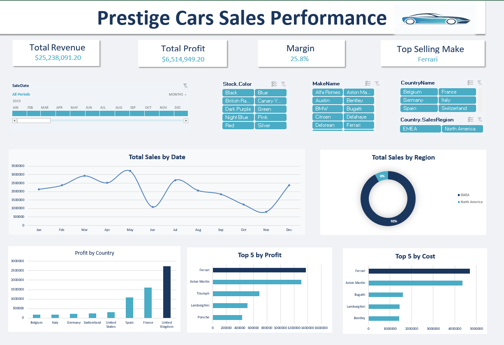

# Prestige Cars Sales Performance Analysis 🚗📊

## Project Overview
This project involves an end-to-end data analysis of a luxury car dealership's sales performance for the year 2015. The objective was to clean the raw data, uncover underlying trends, and build an interactive dashboard to track key financial metrics (KPIs) and evaluate brand performance across global markets.

## Tools & Technologies Used
* **Python:** Used in Google Colab for data cleaning, preprocessing, and exploratory data analysis.
* **Plotly:** Utilized for creating advanced, interactive visualizations.
* **Microsoft Excel:** Used to build the final interactive dashboard, featuring Pivot Tables and dynamic Slicers.

## Key Financial Metrics (KPIs)
* **Total Revenue:** $25,238,091
* **Total Profit:** $6,514,949
* **Profit Margin:** 25.8%

## Key Insights & Findings
1. **Regional Dominance:** The **EMEA** region accounts for the vast majority of sales, contributing **92%** of the total revenue, compared to just 8% from North America.
2. **Top Profitable Markets:** The **United Kingdom** is the most profitable country by a significant margin, followed by France and Spain.
3. **Brand Performance:** **Ferrari** and **Aston Martin** are the most profitable brands. However, they also represent the highest costs, requiring careful pricing strategies to maintain the 25.8% margin.

## Project Files
* `Data_Cleaning_and_EDA.ipynb`: The Google Colab notebook containing the Python code for data cleaning and Plotly visualizations.
* `Prestige_Cars_Dashboard.xlsx`: The final Microsoft Excel file containing the interactive dashboard.
* `Dataset/`: Folder containing the raw and cleaned CSV files.

## How to Use
1. Download the `Prestige_Cars_Dashboard.xlsx` file and open it in Microsoft Excel.
2. Use the slicers at the top right to filter the data by Month, Car Color, Make, Country, or Region.
3. To view the Python code, open `Data_Cleaning_and_EDA.ipynb` in Google Colab or Jupyter Notebook.